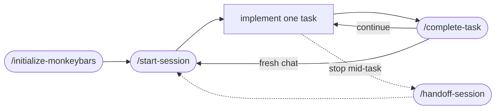

# MonkeyBars


> **Guardrails for vibe monkeys.**
> Monkey thinks up spec. Monkey chunks up spec. Monkey makes iterative progress.

MonkeyBars is a repo-local workflow plugin that turns rough specs, half-built code, and "next release" goals into phase-by-phase reviewable commits. It works with **Codex, Claude Code, and OpenCode**.

It is also a defense against context rot. Claude's
[context-window docs](https://platform.claude.com/docs/en/build-with-claude/context-windows)
put it plainly: *"more context isn't automatically better. As token count grows,
accuracy and recall degrade."* MonkeyBars keeps the important state — plan,
current phase, current task, WIP, handoffs — in the repo, not in one fat chat
that eventually needs compaction.

The goal isn't to keep one chat alive forever. It's to make every chunk small
enough that a fresh context can pick it up and finish.

---

## Install

```sh
npx --package github:paiyar/monkeybars#main -- monkeybars install --project /path/to/repo
```

Or install the CLI globally from git:

```sh
npm install -g github:paiyar/monkeybars#main --install-links=true
monkeybars install --project /path/to/repo
```

Pin to an exact revision when you need a repeatable install:

```sh
npx --package github:paiyar/monkeybars#<tag-or-commit> -- monkeybars install --project /path/to/repo
npm install -g github:paiyar/monkeybars#<tag-or-commit> --install-links=true
monkeybars install --project /path/to/repo
```

The `main` ref is a floating branch. Each install resolves the current tip of
`main`; use an exact release tag or commit SHA when you need a repeatable
install.

Git installs run the repository `prepare` build, so Bun must be on `PATH`
during installation. The installed CLI runs on Node.js 20+. The
`--install-links=true` flag makes npm install the packed Git dependency instead
of linking to npm's temporary Git clone; without it, some npm versions leave the
global `monkeybars` binary pointing at a pruned temp directory. By default
`install` covers all three agents (OpenCode, Claude Code, Codex) and adds
advisory workflow hooks. Pass specific targets or `--no-agent-hooks` to scope
it down:

```sh
monkeybars install opencode claude --project /path/to/repo
monkeybars install --no-agent-hooks --project /path/to/repo
```

## First run

In the target repo, run from your agent:

```text
/initialize-monkeybars   # one-time setup
/start-session           # at the start of each fresh chat
/complete-task           # after one task lands as one commit
/handoff-session         # if you stop mid-task
```

Or use the deterministic CLI to inspect state from a terminal:

```sh
monkeybars status        # current phase / task / WIP
monkeybars next          # what to run next
monkeybars check         # invariants between status.md and phase files
```

## What it adds to your repo

```
your-repo/
├── docs/
│   └── agents/
│       ├── plan.md          active implementation plan
│       ├── status.md        phase / task / handoff pointer
│       ├── prd/             product, architecture, data, interface truth
│       └── work/
│           ├── phase-1.md   reviewable chunk; tasks T01, T02, T03 …
│           └── phase-2.md
└── AGENTS.md                rules every coding agent should follow
```

**Hierarchy:** `plan.md` ─► `phase-N.md` ─► `T01..TN` ─► one commit each.

`docs/agents/plan.md` is intentionally the *active* plan, not a permanent
backlog. When a release is complete, archive it under
`docs/agents/archive/plans/YYYY-MM-DD-<scope>.md` and start a fresh one. Keep
phase numbers monotonically increasing across releases — don't reset to
Phase 1.

## The loop



When the chat starts feeling heavy, run `/context-boundary` and start over from
`/start-session` — the repo carries the state forward.

## Commands

Workflow names are the same across agents. OpenCode and Claude Code expose them
as slash commands; Codex uses skill mentions like `$start-session`.

| # | Command | Use it when | What it does |
|---:|---|---|---|
| 1 | `/initialize-monkeybars` | Once per project | Creates planning docs, `docs/agents/status.md`, first phase file, agent instructions |
| 2 | `/map-codebase` | Brownfield repos with weak current-state docs | Writes `docs/agents/prd/current-*.md` |
| 3 | `/brainstorm-plan` | Specs are rough, missing, stale, or too broad | Turns intent or repo state into phase-ready docs |
| 4 | `/project-status` | Read-only progress check | Summarizes phase, task, blockers, remaining work |
| 5 | `/start-session` | Start of every fresh chat | Reads workflow files, reports the next task |
| 6 | `/create-phase` | Next phase has no phase file | Generates the next `docs/agents/work/phase-N.md` from `plan.md` |
| 7 | `/complete-task` | One task is implemented | Runs preflight, updates tracking, commits once |
| 8 | `/context-boundary` | After a commit, or context is heavy | Recommends continue / handoff / fresh chat |
| 9 | `/handoff-session` | Stopping with unfinished work | Records WIP, blockers, decisions, next steps |
| — | `/workflow-check` | Tracking state may be inconsistent | Verifies status, phase files, and repo state agree |
| — | `/fix-bug` | Urgent bug interrupts phase work | Keeps bug separate, preserves the handoff trail |

## Scenarios

**Greenfield.** Put existing specs (or a rough idea) under `docs/`, run
`/initialize-monkeybars`, then enter the loop above. Use `/brainstorm-plan`
first if the plan is too vague to phase.

**Brownfield rescue.** When a repo has useful code but weak docs, run
`/map-codebase` after `/initialize-monkeybars` to capture current behavior
honestly before inventing a target architecture. The first phase is usually
inventory or stabilization, not features.

**Post-v1 / next release.** When the active plan is complete, archive
`docs/agents/plan.md` to `docs/agents/archive/plans/YYYY-MM-DD-<scope>.md`,
run `/brainstorm-plan` for the next plan, then `/create-phase` with the next
available phase number.

## When to use it

Good fit:

- you want plan chunks reviewed in PRs, not chat history
- tasks small enough to inspect and commit one at a time
- fresh contexts per chunk, not one overloaded session
- the same workflow across Codex, Claude Code, and OpenCode

Skip it:

- one-off edits where planning costs more than the change
- you already have a strong external planning system and just need the agent to execute tickets

## Per-agent details

| Agent | Reads from | Invocation |
|---|---|---|
| OpenCode | `.opencode/commands/`, `.opencode/plugins/` | `/initialize-monkeybars` |
| Claude Code | `.claude/skills/`, `.claude/settings.json` (hooks) | `/initialize-monkeybars` |
| Codex | `.codex/plugins/monkeybars/`, `.agents/plugins/marketplace.json` | `$initialize-monkeybars` |

Hooks are advisory: they inject MonkeyBars context at lifecycle events but
never block tool calls or mutate workflow files. Re-running `install` is
idempotent.

## CLI reference

```sh
monkeybars status
monkeybars next
monkeybars check
monkeybars health
monkeybars preflight [--dry-run]
monkeybars advance --task T01 --commit "feat(T01): finish task"
monkeybars migrate-status
monkeybars doctor
```

## Development

Local checkout (Bun required):

```sh
bun install
bun run generate
bun run test
node dist/index.js install --project /path/to/repo
```

Edit canonical workflow files in `workflow-src/` first, then `bun run generate`.
See [`AGENTS.md`](./AGENTS.md) for the full contributor guide.

### Dogfooding MonkeyBars on this repo

Because the source plugin lives in the eponymous `monkeybars/` directory (not
`plugins/monkeybars/`), you can install MonkeyBars onto its own repo without
collisions:

```sh
bun run generate
node dist/index.js install --project .
```

Install is purely additive: it only writes under `.opencode/`, `.claude/`,
`.codex/`, and `.agents/plugins/marketplace.json`, all of which are gitignored.
Source under `monkeybars/` and `workflow-src/` is never touched by install.
